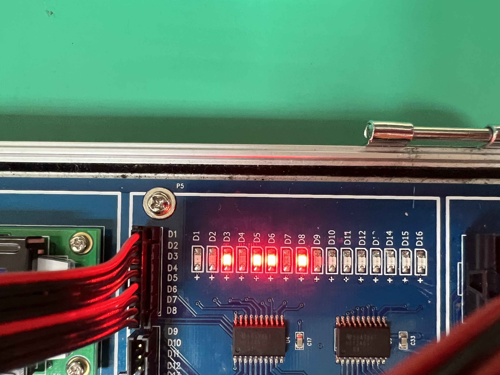
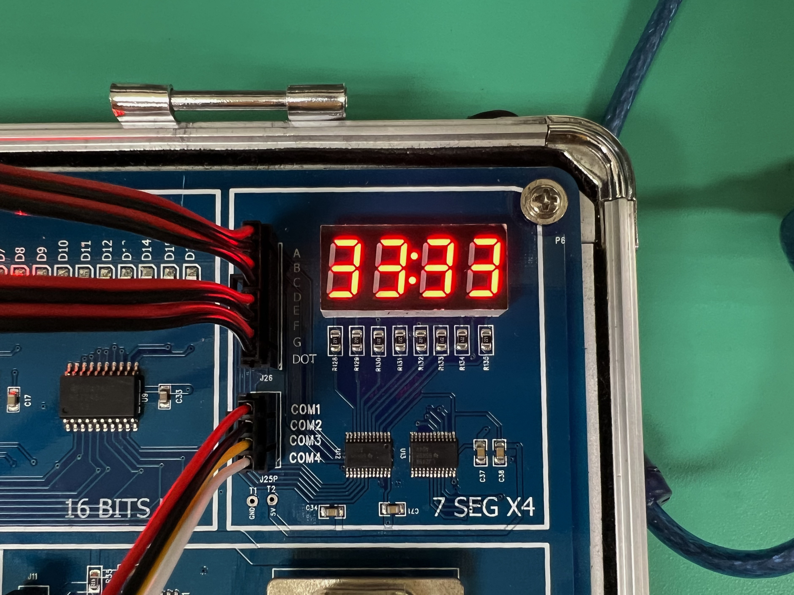

Authors:111321005鍾亦翰 111321024林秉儀
1. Input/Ouput 說明:
* 初始畫面，方塊會從圖片上方落下

<!--  -->
<!--

	

-->

* LED燈顯示累計消掉條數

* 七段顯示器顯示目前等級，跟消掉條數有關，用於控制方塊掉落速度

     

* 結束畫面

* 旋轉、左移、右移、加速下降 -> 接到4-bit SW
* seg[0:6] -> 接到七段顯示器
* line[0:7] -> LED
* DATA_R,DATA_G,DATA_B -> 接到8x8LED
* enable,com[0:2] -> 接到8x8LED控制

2. 遊戲說明：規則同俄羅斯方塊。方塊由上落下，一整排集滿會消掉，LED顯示條數加一。預設每消三條等級升一等。四個按鈕由左而右依序控制旋轉、左移、右移、加速下降。堆疊到頂部後遊戲結束，顯示結束畫面。

3. 程式模組說明：
module tetris(//input Count,
			output reg [7:0] DATA_R, DATA_G, DATA_B,//紅綠藍三色燈
			output reg [2:0] COMM,
			output reg [2:0] s = 3'b000,	// 方塊形狀索引
			output reg [2:0] s4 = 3'b000,	// 方塊形狀索引（用於計時）
			input change, left, right, down,//旋轉、左移、右移、加速下落按鈕
			output enable,	
			output reg [0:1] point = 2'b00,	//經驗值
			output reg [0:6] seg = 7'b0000001,	//七段顯示器用於顯示目前等級
			output reg [0:7] line =8'b00101101,	//消除條數
			input CLK);
4. Demo：

